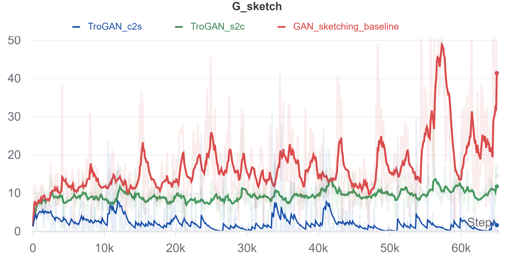

# TroGAN: Disguising Contours to Look Like Sketches
This is our PyTorch implementation of TroGAN: Disguising Contours to Look Like Sketches. We implement a method that builds off the [GAN Sketching](https://github.com/PeterWang512/GANSketching) architecture by introducing an unpaired translation model trained using [CUT](https://github.com/taesungp/contrastive-unpaired-translation) that shifts the distribution of fake sketches to be more similar to that of the user-sketches while also retaining the essence of the initially generated image. Such a formulation avoids overfitting by the discriminator, thus reducing the discriminability and increasing gradient propagation.

Work done by Akshay Dharmavaram and Mayank Mali in partial fullfillment of [16-824: Visual Learning and Recognition](https://visual-learning.cs.cmu.edu/index.html) while at CMU.

## Results

We implemented two TroGAN variations: c2s "contours to sketch" (shown in blue) and s2c "sketch to contours" (shown in green) by introducing a CUT translation model to make sketch discriminator input distributions more similar.

### Generator Sketch Loss
The loss below indicates a quantitative comparison of the two TroGAN architectures against baseline in terms of generator sketch loss. The generator sketch loss is defined as `softplus(-D(G(z)))`. We use this loss as a measure of how well our generator is able to "fool" their respective sketch discriminators. As shown, translating either sketch-discriminator input to look like the other input results in lower loss, however in the next two sections we discuss how s2c qualitatively underperforms baseline.

<p align="center">

</p>

### Faster Training
We observed that the c2s variant required only half the number of training steps (10K vs 20K) as compared to unmodified [GAN Sketching](https://github.com/PeterWang512/GANSketching) (shown in red), as shown below. While, the s2c variant performs quantitatively better (lower generator sketch loss), but qualitatively worse (images less similar to sketch) than the baseline GAN Sketching. We train our GAN using the sketch (shown to the left of the dotted line), and would like our model to learn to semantically similar (left-facing) horses. We show samples from the models at training steps at multiples of 5,000.

<p align="center">

</p>

### Interpolations
We show our interpolation results (latent-space interpolaton between generated sample pairs) and compare to [GAN Sketching](https://github.com/PeterWang512/GANSketching) (shown in red), as shown below. As explained in the previous section, our c2s variant performs quantitatively (lower generator sketch loss) and quatitatively better (more left facing horses), while the s2c variant did not outperform baseline qualitatively. We train our GAN using the same user-sketch shown above, and would like our model to learn to output left facing horses and ideally have interpolations that also face to the left. We show samples from the models at training steps at multiples of 10,000.

<p align="center">

</p>

## Getting Started

We have organized our repositor into three submodules forked from their original repositories. 

1. The [ganSketching](https://github.com/eMYKion/GANSketching) folder contains the modified GAN sketching and incorporated CUT translation model (c2s mode by default).
2. The [cut](https://github.com/eMYKion/contrastive-unpaired-translation) folder contains forked code required to train a CUT model from scratch.
3. The [quickdraw](https://github.com/eMYKion/quickdraw-dataset) folder contains modified forked code to download and render (to image files) the quickdraw user-sketches.

### Cloning our repository

```bash
git clone --recursive https://github.com/Aks-Dmv/TroGAN.git
cd TroGAN
```

### Installation Instructions
To install the requirements for each of the submodules, we have provided a shell script that can be run as follows:

```bash
bash install.sh
```

In order to run our examples, you will need model weights for the vanilla GANSketching network and our CUT translation model (explained below).

### CUT Model

#### Train CUT from scratch

#### Using our pretrained CUT c2s model

If you would like to retrain the cut model, you can follow the steps in the README in the cut folder. We suggest using the grumpy cat scripts as a baseline, and replacing the cat images with the datasets that you would like to use. However, if you would like to just download our pre-trained model, then it can be downloaded from here: 

### Downloading CUT datasets

### GAN Model

#### Using pretrained GANSketching c2s model

To get pretrained GANSketching model weights, follow the directions from the [GANSketching README](https://github.com/eMYKion/GANSketching/tree/8b603e6d1836bf55768bc6d17a2ef133c3338a8f#download-datasets-and-pre-trained-models).

The command (from the `ganSketching` folder) should look like:

```bash
# Download pretrained models from StyleGAN2 and PhotoSketch
bash pretrained/download_pretrained_models.sh
```

### Downloading GANSketching datasets
