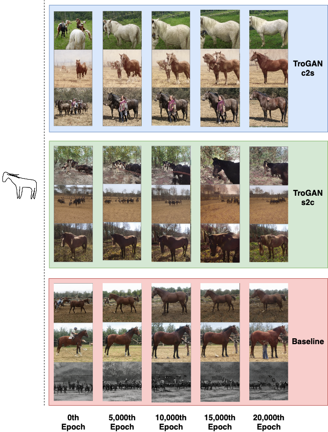

# TroGAN: Disguising Contours to Look Like Sketches
This is our PyTorch implementation of TroGAN: Disguising Contours to Look Like Sketches. We implement a method that builds off the [GAN Sketching](https://github.com/PeterWang512/GANSketching) architecture by introducing an unpaired translation model trained using [CUT](https://github.com/taesungp/contrastive-unpaired-translation) that shifts the distribution of fake sketches to be more similar to that of the user-sketches while also retaining the essence of the initially generated image. Such a formulation avoids overfitting by the discriminator, thus reducing the discriminability and increasing gradient propagation.

Work done by Akshay Dharmavaram and Mayank Mali in partial fullfillment of [16-824: Visual Learning and Recognition](https://visual-learning.cs.cmu.edu/index.html) while at CMU.

## Results
Our method (shown in blue) has shown to reduce the training time of [GAN Sketching](https://github.com/PeterWang512/GANSketching) (shown in red), as shown below. We train our GAN using the sketch (shown to the left of the dotted line), and would like our model to learn to output left facing horses. We show samples from the models at training steps at multiples of 5,000.


## Getting Started

### Cloning our repository
```
git clone https://github.com/Aks-Dmv/TroGAN.git
cd TroGAN
```

### Installation Instructions
To install the requirements for each of the submodules, we have provided a shell script that can be run as follows:

```
$ bash install.sh
```

## Downloading weights
If you would like to retrain the cut model, you can follow the steps in the README in the cut folder. We suggest using the grumpy cat scripts as a baseline, and replacing the cat images with the datasets that you would like to use. However, if you would like to just download our pre-trained model, then it can be downloaded from here: 

## Model Training
